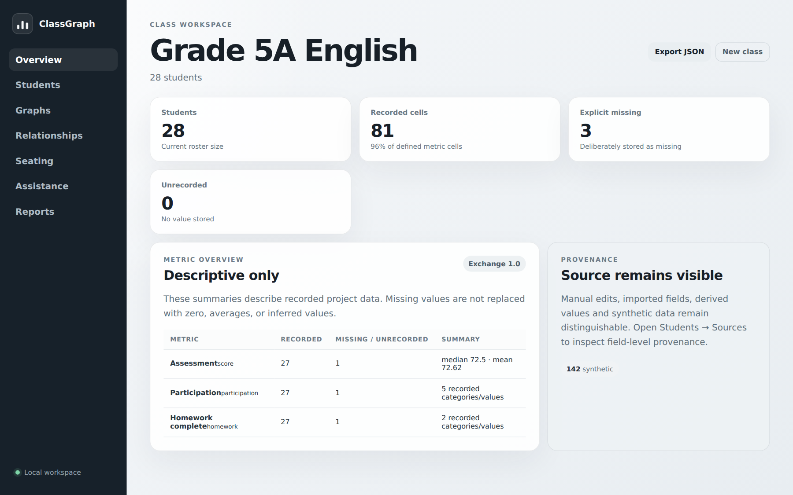
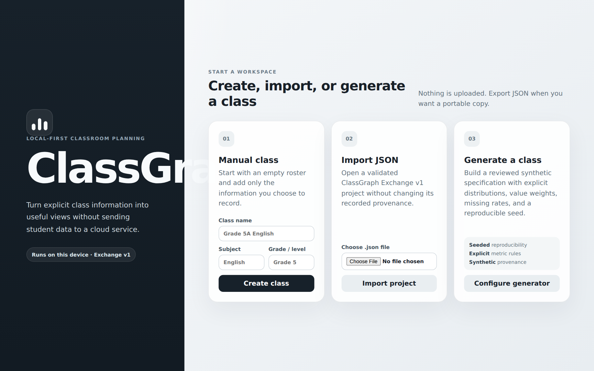
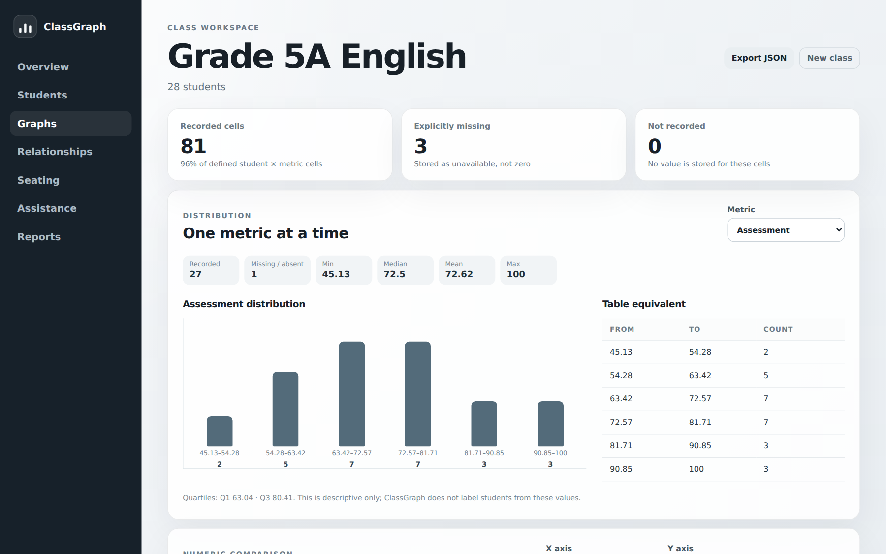

<p align="center">
  
</p>

<h1 align="center">ClassGraph</h1>

<p align="center">
  <strong>Local-first classroom analysis, visualisation, seating and grouping.</strong><br>
  Turn explicit class data into useful views and explainable plans without sending it to a cloud service.
</p>

<p align="center">
  
  
  
  
</p>

## Download

<p>
  <a href="https://github.com/purysho/ClassGraph/releases/latest/download/ClassGraph-Windows-x64.exe"></a>
  <a href="https://github.com/purysho/ClassGraph/releases/latest/download/ClassGraph-macOS-AppleSilicon.app.zip"></a>
  <a href="https://github.com/purysho/ClassGraph/releases/latest/download/ClassGraph-macOS-Intel.app.zip"></a>
  <a href="https://github.com/purysho/ClassGraph/releases/latest/download/ClassGraph-Linux-x64.tar.gz"></a>
</p>

No Node.js installation is needed for these downloads. Each build contains the runtime and ClassGraph UI.

- **Windows** — download `ClassGraph-Windows-x64.exe` and run it directly.
- **macOS Apple Silicon** — for M1/M2/M3/M4 and later Apple-chip Macs.
- **macOS Intel** — for Intel-based Macs.
- **Linux** — extract `ClassGraph-Linux-x64.tar.gz`, make the executable runnable if required, and launch it.
- **Verify a download** — compare it with [`SHA256SUMS.txt`](https://github.com/purysho/ClassGraph/releases/latest/download/SHA256SUMS.txt).

> Windows builds are currently unsigned and macOS builds are ad-hoc signed rather than notarised. Windows SmartScreen or macOS Gatekeeper may therefore show a first-run warning.



## What ClassGraph does

| Understand the class | Plan the room | Keep decisions explainable |
| --- | --- | --- |
| Descriptive distributions, completeness, scatter comparisons and accessible tables. | Manual or generated seating and grouping with hard constraints, soft objectives, locks and reproducible seeds. | Provenance stays attached to data, missing values stay distinct, and candidate plans expose their rules and trade-offs. |
| Import or enter the data you actually use rather than adopting a fixed student model. | Track explicit relationship records, repeat neighbours and saved planning scenarios. | Export portable JSON, DOCX and PDF reports without turning derived or synthetic data into observed facts. |

ClassGraph is designed to support teacher judgement. It does **not** diagnose students, infer hidden personality or ability traits, claim causation from correlations, or predict future attainment.

## Screenshots

| Start a workspace | Explore class data |
| --- | --- |
|  |  |

## A local-first workflow

1. **Create, import, or generate** a class.
2. **Record the metrics you choose** and keep observed, entered, imported, derived, and synthetic values distinguishable.
3. **Explore descriptive views** before making planning changes.
4. **Build seating or grouping candidates** against explicit constraints and objectives.
5. **Review the explanation**, then accept, change, or ignore the suggestion.
6. **Export** the project, analysis, seating plan, DOCX, or PDF when you need a portable copy.

ClassGraph binds to `127.0.0.1` by default. Core workflows work without a cloud account, telemetry, remote fonts, or remote scripts.

## Optional assistance

The assistance layer is optional and remains proposal-only.

- Draft a structured synthetic-class specification from teacher language.
- Explain existing descriptive analysis in plain language.
- Draft report wording from a validated report snapshot.
- Suggest candidate planning rules from explicit supported relationship records.
- Preview the exact context before any optional network request.
- Keep provider credentials outside project files, exports, and browser storage.

With no provider configured, the core app and offline assistance remain usable.

## Key principles

- **Local first.** Student data stays on the device unless the teacher explicitly exports or sends it.
- **Missing is not zero.** Explicitly missing and not-recorded values remain distinct.
- **Provenance is visible.** Observed, teacher-entered, imported, derived, and synthetic data are not collapsed together.
- **No black-box student labels.** ClassGraph does not silently infer intelligence, personality, motivation, behaviour diagnoses, or future outcomes.
- **Explain the plan.** Seating and grouping candidates show the constraints, objectives, penalties, and remaining trade-offs.
- **Accessible equivalents.** Important visual views retain table-based alternatives.
- **Portable by design.** Versioned JSON is the machine-readable source of truth.
- **Lean runtime.** The desktop downloads use Node Single Executable Applications rather than bundling Electron.

## Run from source

Requirements:

- Node.js 22 or newer
- npm

```bash
npm ci
npm run check
npm run build
npm start
```

Then open:

```text
http://127.0.0.1:4317
```

For development:

```bash
npm run dev
```

`CLASSGRAPH_PORT` can change the local port. `CLASSGRAPH_HOST` can override the host, but a non-loopback host may expose student data to other devices and should only be used deliberately on a trusted network.

### Optional network provider

Network assistance is **off by default**. To enable the generic HTTPS provider boundary, set:

```text
CLASSGRAPH_ASSISTANCE_URL=https://provider.example/assist
CLASSGRAPH_ASSISTANCE_PROVIDER_LABEL=Example Provider
CLASSGRAPH_ASSISTANCE_TOKEN=optional-bearer-token
```

`CLASSGRAPH_ASSISTANCE_URL` must use HTTPS. Every network request still requires a visible context preview and explicit send confirmation.

## Current outputs

- Editable student/class table
- Metric completeness views
- Numeric distributions and descriptive statistics
- Category, ordinal, boolean and text counts
- Numeric scatter comparisons with table equivalents
- Field-level provenance inspection
- Manual and generated seating/grouping plans
- Explicit relationship table and relationship graph
- Repeat-neighbour history
- Saved planning-scenario comparisons
- Versioned project, analysis and seating-plan JSON
- Local DOCX descriptive reports
- Local PDF descriptive reports
- Landscape seating-plan PDFs
- Offline assistance proposals
- Optional network assistance with pre-send disclosure

<details>
<summary><strong>Implementation history — Phases 1–6</strong></summary>

### Phase 1 — Workspace and analysis

Manual projects, Exchange JSON import/export, roster and metric editing, provenance inspection, descriptive completeness/distributions/statistics, scatter comparisons, and deterministic synthetic classes.

### Phase 2 — Seating and grouping

Grid rooms, enabled/disabled seats, seat tags, manual assignments, locks, hard constraints, soft objectives, deterministic seating/grouping candidates, explanations, and persisted planning state.

### Phase 3 — Reports and portable exports

Versioned analysis/seating exports, DOCX/PDF reports, landscape seating-plan PDF, safe local download endpoints, and portable interchange contracts.

### Phase 4 — Relationships and scenario comparison

Explicit relationship records, deterministic relationship network/table views, repeat-neighbour history, saved scenarios, and descriptive before/after comparisons.

### Phase 5 — Optional assistance

Offline proposal generation plus an optional direct-HTTPS provider boundary with exact-context preview, explicit confirmation, response validation, and no automatic project mutation.

### Phase 6 — Desktop releases

Self-contained Windows, macOS Apple Silicon, macOS Intel, and Linux builds using Node 22 Single Executable Applications, native executable self-tests, release automation, and SHA-256 checksums.

</details>

## Design and recovery documents

- [`DESIGN.md`](DESIGN.md) — product and architecture contract
- [`docs/INTERCHANGE.md`](docs/INTERCHANGE.md) — Exchange v1 interoperability notes
- [`docs/PHASE1_LOG.md`](docs/PHASE1_LOG.md) — Phase 1 recovery log
- [`docs/PHASE_2.md`](docs/PHASE_2.md) — Phase 2 recovery and Gate 2
- [`docs/PHASE_3.md`](docs/PHASE_3.md) — Phase 3 recovery and Gate 3
- [`docs/PHASE_4.md`](docs/PHASE_4.md) — Phase 4 recovery and Gate 4
- [`docs/PHASE_5.md`](docs/PHASE_5.md) — Phase 5 recovery and Gate 5
- [`docs/PHASE_6.md`](docs/PHASE_6.md) — Phase 6 recovery and Gate 6

## Branding

- [ClassGraph mark](docs/branding/classgraph-mark.svg)
- [ClassGraph lockup](docs/branding/classgraph-lockup.svg)

## License and security

See [`SECURITY.md`](SECURITY.md) for the current security boundary and responsible-use notes.

---

<p align="center">
  
</p>
